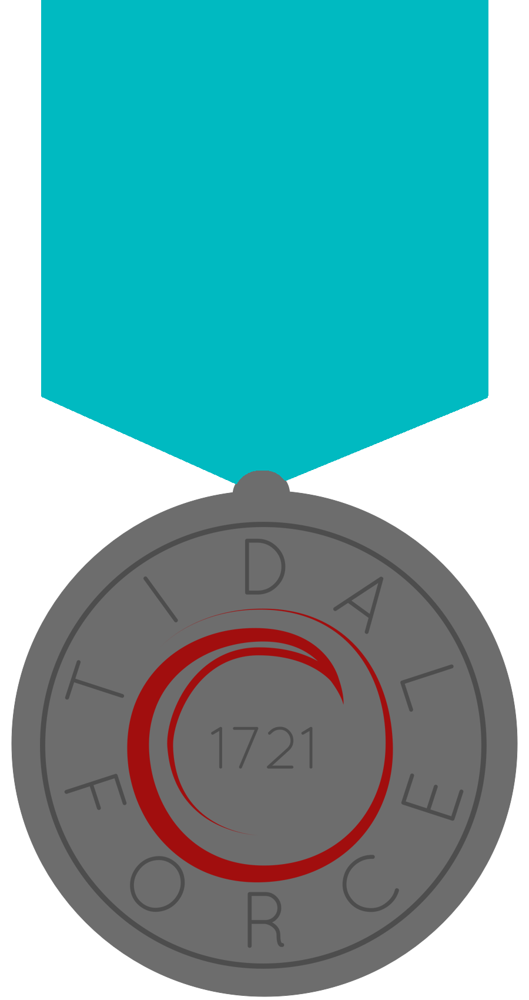
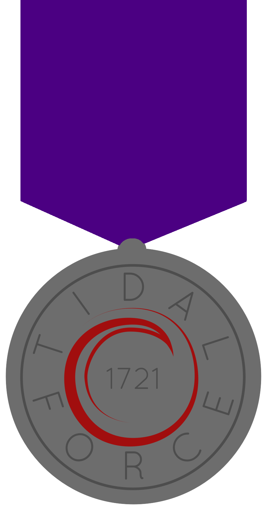
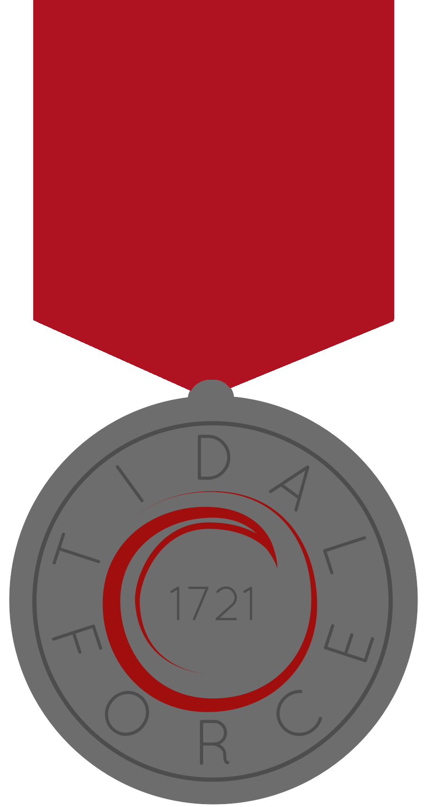

Medals
######

Medals are awarded at the end of every year.

The Enderson Award
==================

   The Enderson award is the msot prestegious award granted to a member of Concord Robotics. It is not 
   required to be awarded every year. It is named in honor of a past Captain Amanda Enderson.

The Captian's Award
===================

.. figure:: ../../awards/medals/captain_medal.png
   :width: 150
   :alt: Captain Award

   The Captain's award is awarded by the captain for []

The President's Award
=====================

   The President's award is awarded by the robotics board president for []

The Mentor's Award
==================

   The Mentor's award is awarded by the lead mentor for outstanding dedication to
   robotics especially during build season.
