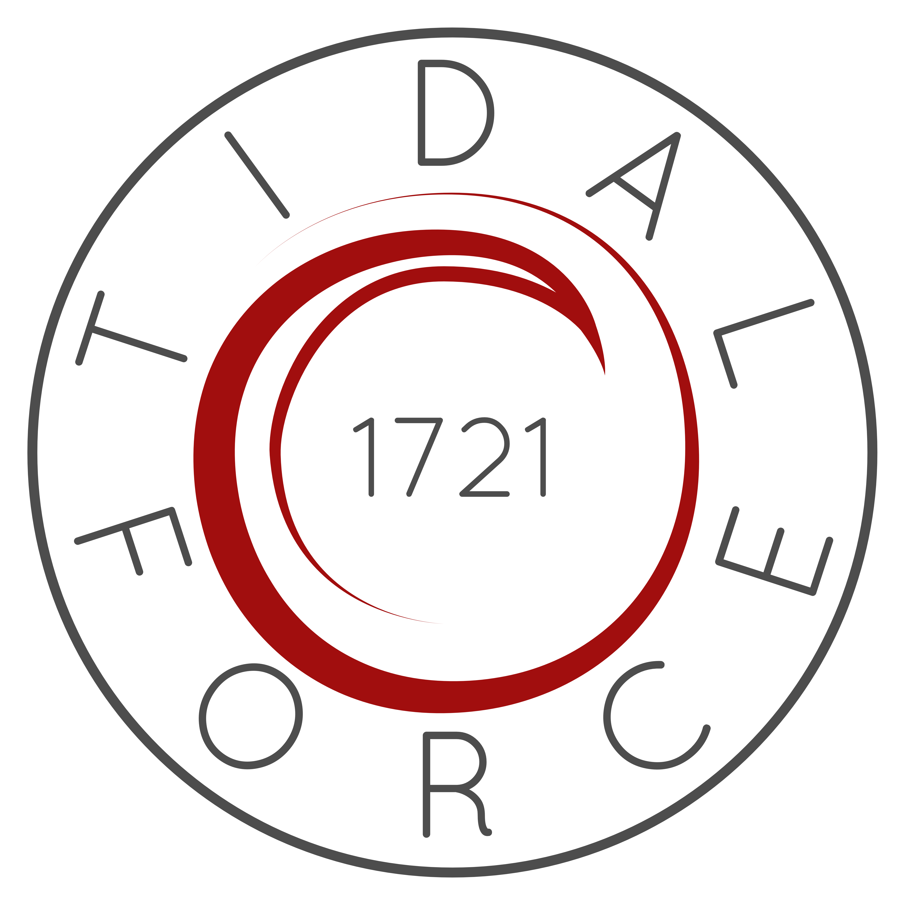
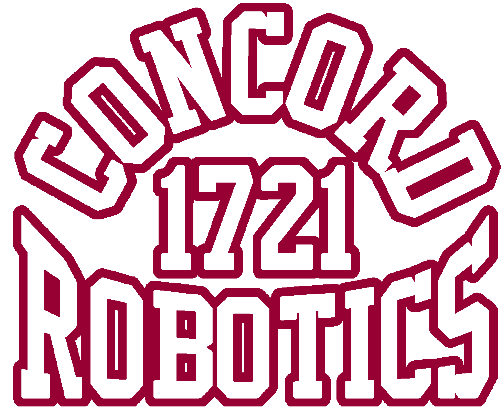
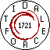
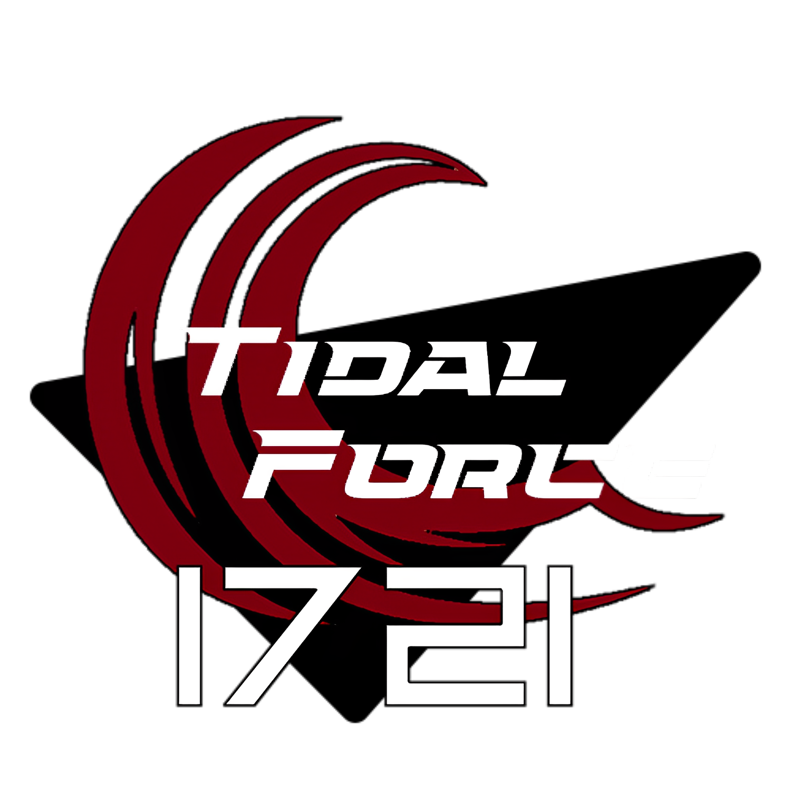
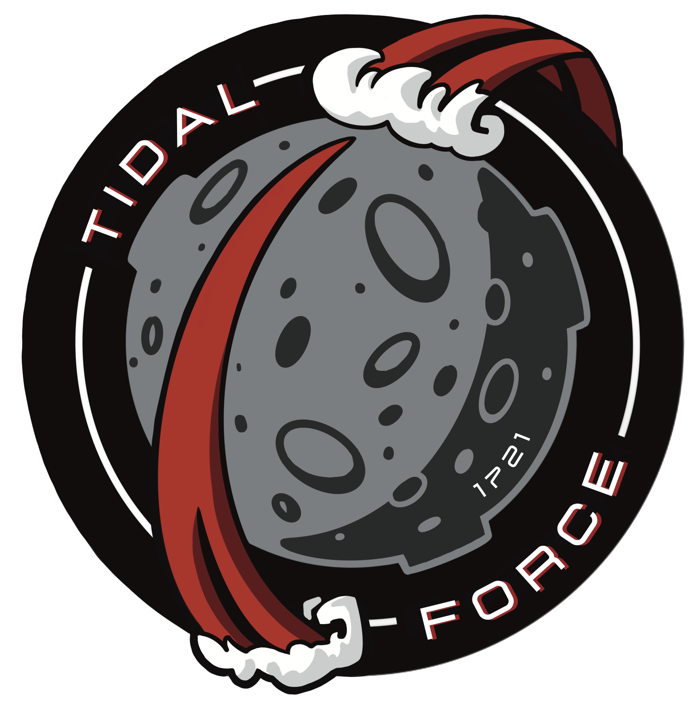

Logos
#####

All Official Team Logos and variants.

Submit a PR to have your logo added!

2017
====

   Not the oldest but the most commonly used official logo, commissioned
   in 2016, we went to worlds with this logo and it stuck.

   This logo was reserved for merch/hoodies. Becoming particularly favorited on
   hoodies and other more casual team merch. This logo was never used on official
   team uniforms but counts perfectly fine as a uniform for demos, outreach and 
   offseason events.

2018
====

   The 8-bit logo used in 2018, originally made by Caleb.
   This is also the logo we used for the FMS scoring system during comp.

2019
====

.. figure:: ../../logos/2019/rendered/Joes_2019_Season_Logo_(CW_SPIN,_TSHIRT,_STARS).png
   :width: 60%
   :alt: 2019 Logo

   This series of logos designed by Joe for the 2019 season, they come in several flavors.

.. figure:: ../../logos/2019/rendered/Joes_2019_Season_Logo_(CW_SPIN,_NOBACKGROUND).png
   :width: 60%
   :alt: 2019 Logo

   Inverted Variant

2023
====

   Inspired by the cyberpunk nature of the 2023 game, this cyberpunk logo was used for the 
   2023 season. Designed by Connor_.

2024
====

   The 2024 season logo for Crescendo was designed by Veronica.

.. _Connor: https://github.com/RealConar