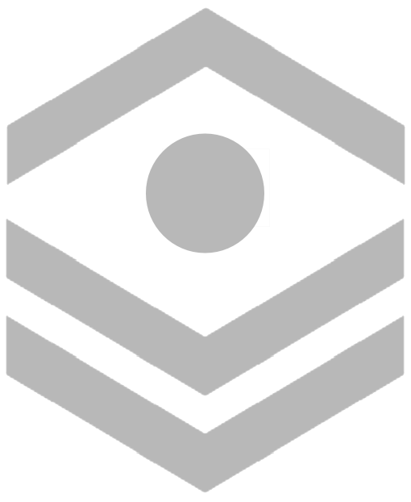

Chevrons
########

Chevrons 101
============

How to Interpret Chevrons
-------------------------

The team chevrons come in three colours, Red, White, and
Gold. Red denotes standard, a baseline colour which is
used for active student team members and mentor
chevrons. White denotes Alumnanship, used to reflect a
Alumni's position or creditable actions on the team. 
Finally, Gold denotes senior leadership, Captain and Ast.
Captain positions. 

Chevron Hierarchy
-----------------

The team chevrons, when in competition with each other, 
when two chevron designs impede each other, white will
always replace red [1]_ and gold will always replace white.

In the case of Lead mentor retiring from their position,
and they receive a white Lead mentors patch, and later
return to the position, Red will replace white as the
position is reactivated. However no Team position patches
in Alumnanship can be replaced by Red, as no Alumni can
serve on those positions [2]_.

Patch Placement
---------------

The team patches reflect drive team positions, subteam 
denotations for leads, Captain's position, and lead mentor
position. Similar to chevron colours, Red denotes active
work for the patch, and white an Alumni of the position [3]_.
Gold denotes senior leadership, and it used for Captain
and asst. captain.

White patches are only given out to Alumni's who've worked
in the position either as lead, or on drive team, or as a
mentor which is worthy of their work being memorialized a
white patch [4]_.

Team Chevrons
============================

Senior Team Leadership Identifications
--------------------------------------

Senior team leadership, the Captain and Asst. Captain
roles are following chevron designs:

.. image:: patches/renders/captain.png
   :height: 175
   :alt: Picture of Captain livery

Captain's livery.

.. image:: patches/renders/asst_captain.png
   :height: 175
   :alt: Picture of Asst. Captain's livery

Co-Captain's livery.

In retirement of the roles, the Captains C patch is handed
handed down to the next captain [5]_ and so is the Asst. Capt patch.
However the gold and half gold chevrons are kept by the members
for their Alumni chevrons, however the red chevron behind Asst.
Capt bar must be changed to white.

The Captain's C does not always need to be passed on if it's
unpresentable condition. In which the C patch should be 
catalogued for all the captains who've worn it and put in archive.
While a replacement is made

Team Leads Identifications
--------------------------

Subteam Chevrons Identifications
--------------------------------

.. image:: patches/renders/electrical_lead.png
   :height: 175
   :alt: Picture of Electrical Lead's livery

Electrical Lead's livery.

Team Patches Identifications
----------------------------

Mentor Chevrons
===============

Mentor Chevrons + Patches Identifications
-----------------------------------------

Lead mentor's livery.

.. image:: patches/renders/adult_drivecoach.png
   :height: 175
   :alt: Picture of adult drivecoach mentor's livery

Mentor drive coach who was not an alumni [6]_.

Alumni Mentors Chevrons
-----------------------

.. image:: patches/renders/alum_captain.png
   :height: 175
   :alt: Picture of Alumni Captain's livery

Alumni Captain's livery.

.. image:: patches/renders/alum_asst_captain.png
   :height: 175
   :alt: Picture of Alumni Assistant Captain's livery

Alumni Assistant Captain's livery.

.. image:: patches/renders/alum_drivecoach.png
   :height: 175
   :alt: Picture of Alumni drivecoach's livery

Alumni drive coach who was lead of electrical and lead of mechanical
during their time as a team member. (Likely not during the same years)

ALUMNI Chevrons
=====================================

Alumni Chevrons Identifications
-------------------------------

Alumni Patches Identifications
------------------------------

.. Footnotes

.. [1] Except in cases where... 
.. [2] Exception for replacements...
.. [3] Exception for this...
.. [4] Exception for that...
.. [5] Exception for thing...
.. [6] This may be incorrect, do all mentors get a bottom white chevron?
