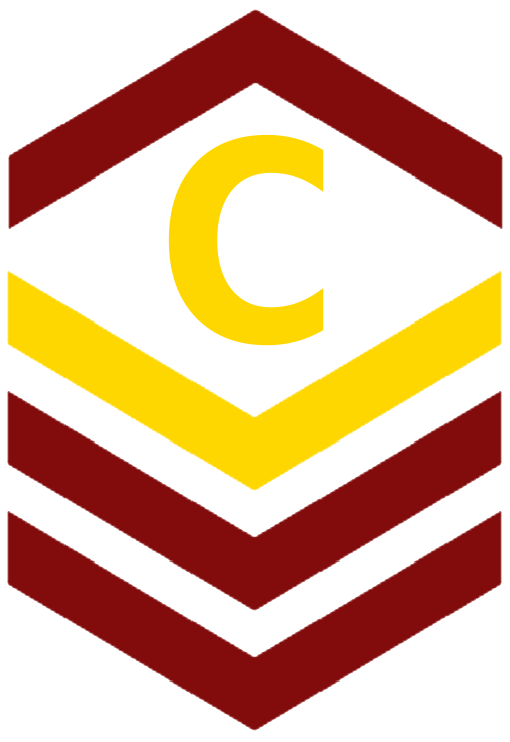
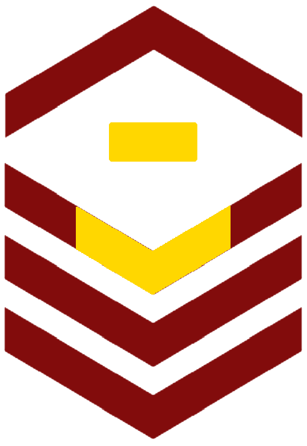
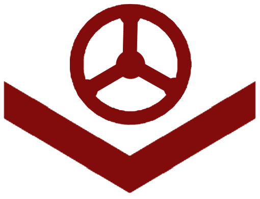

Team Roles
##########

Core Team Leadership
--------------------

The Core Team Leadership consists of the officially recognized
positions by *FIRST* and our own core views.

   The role of Team Captain is the most powerful single position
   on the team. They direct everything from robot construction to
   outreach, team events and anything else. They are always a student.

   The Assistant-Captain is the second highest position on the team, it is not 
   necessarily filled every year. The co-captain directly leads the team
   along with the Captain, and serves in their absence with all the command associated.
   The assistant captain is always a student.

.. figure:: patches/renders/saftey_captian.png
   :width: 125
   :alt: Safety Captain's livery

   The Safety Captain technically wields "the most powerful position" on the team, with the
   exclusive ability to veto any decision even by the captain on argument of Safety. They are
   always a student, they are expected to ensure safety in all aspects, not just in build season.

.. figure:: patches/renders/mechanical_lead.png
   :width: 125
   :alt: Lead of Mechanical's livery

   The Lead of Mechanical is a student on the team with exceptional mechanical skills and/or
   leadership skills. They provide active communication between the Captain about feasibility of
   team member designs, and direct the construction, logistics and manufacturing of the 
   robot parts. They ensure the function of their own subteam of Mechanical Students.
   In the offseason they direct mechanical training and pre-season projects

.. figure:: patches/renders/cad_lead.png
   :width: 125
   :alt: Lead of CAD's livery

   The Lead of CAD is a student on the team with exceptional CAD skills and/or
   leadership skills. They provide active communication between the Captain and their
   subteam of CAD students, they help to bring the ideas and designs from the whiteboard
   to 3d for simulation, fine tuning and finally implementation by handing designs off to
   the mechanical team. 

.. figure:: patches/renders/software_lead.png
   :width: 125
   :alt: Lead of Software's livery

   The Lead of Software is a student on the team with exceptional software skills and/or
   leadership skills. They provide active communication between the Captain and their own
   subteam of Software Students. They are responsible for all robot software as well as the 
   infrastructure used by Mechanical, CAD, Media and other teams as "IT Support".

Supplementary Team Leadership
-----------------------------

.. figure:: patches/renders/mechanical_asst.png
   :width: 125
   :alt: Assistant Lead of Mechanical's livery

   The Assistant Lead of Mechanical is assistant to the Lead of Mechanical, they serve in
   their absence and are another bridge between mechanical team members, the other leads, and the
   captain. This role is always a student, this role is not always filled.

.. note:: This role is often promoted by the Lead of Mechanical

.. figure:: patches/renders/cad_asst.png
   :width: 125
   :alt: Assistant Lead of CAD's livery

   The Assistant Lead of CAD is assistant to the Lead of CAD, they serve in
   their absence and are another bridge between CAD team members, the other leads, and the
   captain. This role is always a student, this role is not always filled.

.. note:: This role is often promoted by the Lead of CAD

.. figure:: patches/renders/software_asst.png
   :width: 125
   :alt: Assistant Lead of Software's livery

   The Assistant Lead of Software is assistant to the Lead of Software, they serve in
   their absence and are another bridge between Software team members, the other leads, and the
   captain. This role is always a student, this role is not always filled.

.. note:: This role is often promoted by the Lead of Software

Other Roles
-----------

.. figure:: patches/renders/electrical_lead.png
   :width: 125
   :alt: Lead of Electrical's livery

   The Lead of Electrical is responsible for all things electrical on the robot, this role
   is often filled by the Lead of Software but not always, the subteam is also usually small
   but not always. Like other Leads, their expert opinion is sought in times of discussion 
   with the Captian.

.. figure:: patches/renders/outreach.png
   :width: 125
   :alt: Lead of Outreach's livery

   The Lead of Outreach maintains connections with outreach partners such as local FLL teams, local events (like
   market days) and other 'outreach events'. They are the glue that ties the financial, online and resource (Buisness, 
   Media and Quartermaster) together.

.. figure:: patches/renders/quartermaster.png
   :width: 125
   :alt: Quartermaster's livery

   The Quartermaster is responsible for the organization, categorization, and tidyness of the Team's
   resources. They are often a student on the team with exceptional organization abilities. This role
   is not always staffed.

.. figure:: patches/renders/business_lead.png
   :width: 125
   :alt: Lead of Business's livery

   The Business Lead is responsible for all things financial, especially securing grants and funding, organizing
   sponsorship packets, maintaining sponsor relationships, and assisting in ordering and spending.
   They frequently work alongside the Lead of Outreach but wield a similar position.

.. figure:: patches/renders/media_lead.png
   :width: 125
   :alt: Lead of Media's livery

   The Lead of Media maintains the media presence of the team, they maintain our active social media services as well
   as moderate team online spaces such as the website, discord, the email chain, etc. They work heavily with the Lead 
   of outreach.

Competition Roles
-----------------

.. figure:: patches/renders/scouting_lead.png
   :width: 125
   :alt: Lead of Scouting's livery

   Scouting is an activity common in first where team members record and judge the performance of other teams
   in an effort to find and secure strong teams for possible alliance section, the lead of scouting co-ordinates
   these actions among their ad-hoc team of Scouters.

.. figure:: patches/renders/pitcrew.png
   :width: 125
   :alt: Pitcrew's livery

   Each member of pitcrew bears this patch, signifying their role in the pits (witch has a limited space) they are 
   often (but not always) the most experienced mechanical, software/electrical members.

   The Driver drives the robot, this role changes year to year based on the game, but in general the driver can expect
   to handle the locomotion of the specific bot wether through swerve drive, meccannum drive, tank drive, etc. They are
   chosen by skill, normally with driver tryouts, any student (regardless of seniority) can have this position.

.. figure:: patches/renders/operator.png
   :width: 125
   :alt: Operator's livery

   The Operator operates the robot, this role changes year to year based on the game, but in general the operator can expect
   to handle the operation of the specific bot wether through moving arms, intakes, shooters, climbers etc. They are chosen
   based on skill, normally with operator tryouts, any student (regardless of seniority) can have this position.

.. figure:: patches/renders/humanplayer.png
   :width: 125
   :alt: Human Player's livery

   The Human Player is a very volatile position, it changes wildly from year to year, in 2017 the human player was *inside* the
   field playing area. This is generally an athletic and/or wildly enthusiastic team member!

.. figure:: patches/renders/alum_drivecoach.png
   :width: 125
   :alt: Drivecoach's livery

   The Drivecoach is the glue that binds the Driver and Operator together, their patch is a single upwards facing chevron added
   to their liverly. This role is often an Alumni of the team, but not always. They cannot interact with the robot or field only coach.
   They keep eyes and ears open for changes in game play, and direct drivers with strategy on the fly, keeping track of time, robot position,
   advantageous scouring strategy etc.
